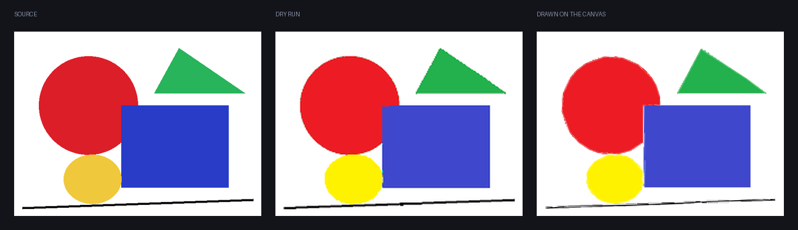
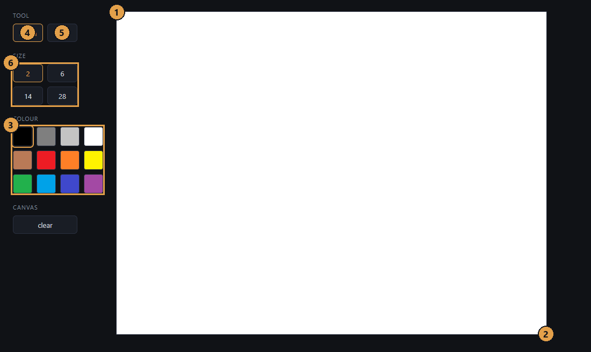
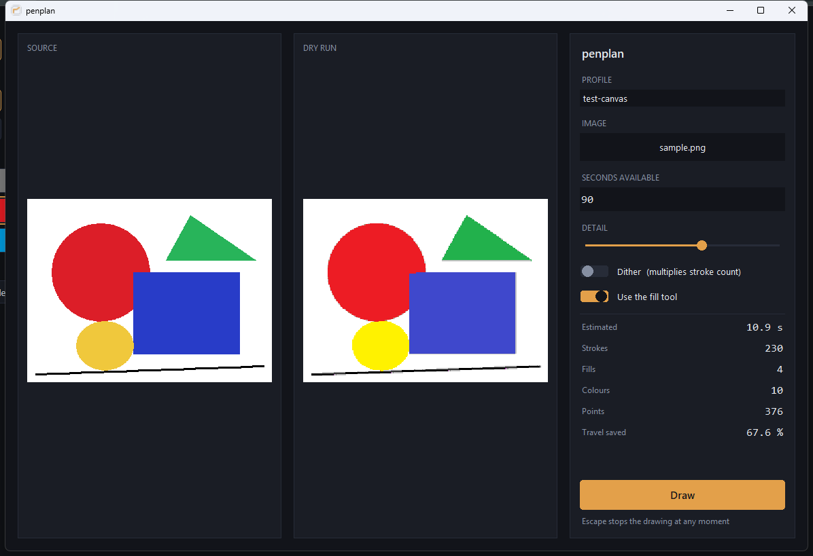

# penplan

[](https://github.com/joyboyisalive07-lab/penplan/actions/workflows/ci.yml)
[](LICENSE)

Воспроизводит изображение на браузерном холсте для рисования, двигая настоящую
мышь, и планирует штрихи так, чтобы рисунок был закончен за заданное вами время.

<br>



Средняя панель — сухой прогон, сделанный до того, как что-либо сдвинулось.
Правая — снимок холста после. План под ними был оценён в 10.0 секунды и
исполнился за 10.1.

Инструмент ничего не знает про конкретный сайт. Он изучает холст по профилю
калибровки: где холст, какие цвета на самом деле в палитре — считанные с экрана,
а не записанные с ваших слов, где кисть и заливка, какие есть размеры кисти.
Gartic Phone, skribbl.io, drawaria.online и Windows Paint для него одна и та же
задача.

Он видит экран и двигает мышь. Он не внедряет скрипты в страницу, не трогает
сетевой трафик сайта, не управляет аккаунтом и вообще не делает сетевых запросов.

English: [README.md](README.md).

## Как работает планировщик

    картинка -> квантование -> области -> заливки -> штрихи -> маршрут -> бюджет -> план
                                                                                    |
                                                        предпросмотр (PNG)   +-> расписание -> исполнение

**Квантование** отображает картинку на палитру профиля в CIE Lab по CIEDE2000, а
не по расстоянию в RGB: равные шаги в RGB не равны шагам восприятия, и разница
видна на коже и на небе. Упорядоченный дизеринг Байера есть и выключен по
умолчанию: он больше чем удваивает число смен цвета вдоль строки, а платит за
каждую бюджет времени.

**Области** — связные участки одного цвета, четырёхсвязные, хранятся
горизонтальными отрезками.

**Заливки** — лучшая сделка в планировщике, один клик вместо тысяч пикселей, и
единственный шаг, способный уничтожить рисунок. Поэтому ни одна не выдаётся на
доверии: контуры рисуются на симулированном холсте, заливка запускается из того
самого семени, по которому будет клик, и один пиксель наружу — отказ. Отказ
ничего не стоит: незакрашенное остаётся незакрашенным, и планировщик штрихов
подберёт его сам.

**Штрихи** получают размер кисти из морфологической эрозии: кисть применяется
только там, где целиком помещается в остаток, поэтому толстая берёт нутро, а
тонкой достаётся граница. Отрезки сцепляются в полилинии и упрощаются алгоритмом
Рамера-Дугласа-Пекера.

**Маршрут** — кластеризованная задача коммивояжёра: перемещение стоит
расстояния, а смена цвета — ещё и похода в палитру. Построение ближайшим
соседом, затем 2-opt по спискам соседей, полный поиск для худших рёбер и Or-opt,
всё под ограничением времени, причём штрих можно рисовать в любую сторону.

**Бюджет** оценивает длительность по модели стоимости, измеренной на вашей
машине, и при перерасходе ухудшает план в объявленном порядке: выбросить мелкие
области, упростить сильнее, отказаться от тонких кистей, урезать палитру.
Ступень остаётся, только если она действительно сократила план, и каждая
сообщает, сколько секунд купила. План, который не влезает, так и говорит.

Подробности в [docs/ALGORITHM.md](docs/ALGORITHM.md), причина каждого
неочевидного решения — в [docs/DECISIONS.md](docs/DECISIONS.md).

## Числа

Всё измерено и воспроизводится тестами и инструментами из этого репозитория.

| | |
| --- | --- |
| Оценка против того же рисунка, исполненного вживую | 10.0 с по плану, 10.1 с на деле |
| Ширины кистей, измеренные тестовыми штрихами | 2.0, 6.0, 14.0, 28.0 против заданных страницей 2, 6, 14, 28 |
| CIEDE2000 против 29 опубликованных пар Sharma | совпадает до 1e-4 |
| Планирование рисунка 600x450 из пяти фигур | 0.12 с, 5 заливок, 65 штрихов, 161 точка |
| Этот план против квантованной цели | расходится на 0.24 % пикселей |
| Разбиение на области, 900x700, десять цветов | 59 мс, на худшем шуме 2 с |
| Путь мыши, упорядоченный против исходного | короче на 52-87 % |
| Проходы улучшения против полного 2-opt, 200 штрихов | 16955 за 0.26 с против 16754 за 0.64 с |
| Рисунок на 20.5 с при бюджете 15 с | 9.0 с после четырёх жертв |
| Покрытие планирующих модулей по строкам | 95.1 % |

## Калибровка холста

Это единственный шаг, который делает инструмент рабочим именно на вашем экране,
и он занимает минуту. Gartic Phone, skribbl.io и drawaria.online калибруются
совершенно одинаково.



**Сначала** поставьте масштаб браузера 100 % через `Ctrl+0`, разверните окно и
расположите его так, чтобы холст, нужные цвета, оба инструмента и размеры кисти
были видны одновременно. После этого не прокручивайте страницу: прокрутка
уводит холст из-под всех координат, которые вы сейчас снимете.

**Потом** запустите мастер, назвав профиль так, как узнаете его в списке:

```bash
python tools/calibrate.py gartic-phone --measure
```

Вверху экрана появится полоса с текущей инструкцией поверх всех окон, чтобы её
было видно, пока вы наводите курсор на браузер.

**Потом** наводите курсор на то, что он просит, и жимите **F8**. **F9**
заканчивает список, **Escape** прерывает в любой момент. Порядок жёсткий:

1. левый верхний угол холста,
2. правый нижний угол холста,
3. каждый цвет палитры, который хотите использовать, затем F9,
4. кисть,
5. заливка,
6. каждый размер кисти, от тонкого к толстому, затем F9.

Пока вы наводите, не делается ни одного клика. Клик по углу холста оставил бы
точку на рисунке, клик по свотчу переключил бы инструмент на середине
калибровки. Цвета читаются после, с курсором, отведённым в центр холста: на
большинстве сайтов свотч под указателем нарисован подсвеченным, и эта подсветка
попала бы в профиль вместо цвета.

`--measure` рисует на холсте по тестовому штриху на каждый размер кисти и один
зигзаг — так планировщик узнаёт, что кисть реально закрашивает и с какой
скоростью холст успевает принимать точки. **Потом очистите холст.** Без флага
ширины кисти — правдоподобная догадка, и профиль хранит, что именно у вас.

Профиль ложится в `%APPDATA%\penplan\profiles\` читаемым JSON.

Перед отправкой хотя бы одного события мыши палитра считывается с экрана заново
и сверяется с профилем. Если окно переехало, изменился масштаб или профиль с
другой машины, инструмент называет несовпавший свотч и отказывается работать, а
не кликает по тому, что там теперь оказалось.

**Сначала потренируйтесь.** Откройте в браузере `tools/testcanvas.html` из этого
репозитория: обычный HTML-canvas с палитрой, двумя инструментами и четырьмя
размерами кисти, и он ничей. Откалибруйтесь по нему, порисуйте, почувствуйте,
что делают ползунок детализации и бюджет, и только потом идите в настоящий
раунд. Штатный профиль `test-canvas` сделан по нему, и картинка в начале файла
нарисована на нём.

### Про Gartic Phone отдельно

- **Калибруйтесь в приватном лобби, в своём раунде.** Экран рисования есть
  только пока идёт раунд, а калиброваться посреди чужой игры и невежливо, и
  некогда. Таймер раунда — в правом верхнем углу.
- **Холст** — белый лист посередине. Углы снимайте по белому, а не по
  фиолетовой рамке вокруг него.
- **Палитра** — блок из восемнадцати свотчей слева, по три в ряд. Широкий
  чёрный прямоугольник под ними — это текущий цвет, а не свотч: сняв его, вы
  запишете в профиль то, что сейчас выбрано.
- **Кисть** — карандаш вверху панели инструментов справа. **Заливка** — ведро
  в той же панели, в ряду с линией. Ластик, фигуры, отмена и повтор не нужны.
- **Размеры кисти** — ряд из пяти круглых кнопок внизу слева, от меньшей к
  большей. Ползунок рядом с ними это не размер, его не трогайте.
- **Никогда не снимайте кнопку ГОТОВО.** Она отправляет рисунок, и профиль,
  считающий её размером кисти, нажмёт её посреди рисования.
- **Ставьте бюджет равным остатку раунда минус пять секунд.** Оценка точна
  примерно до процента, но раунд, закончившийся посреди штриха, отправит
  недорисованное.
- **Палитра там больше, чем нужно.** Двенадцати цветов хватает почти на любую
  картинку, а каждый невзятый цвет — это поход в палитру, которого не будет.

Длинная версия, вместе с тем что делать когда что-то пошло не так, лежит в
[docs/CALIBRATION.md](docs/CALIBRATION.md).

## Как пользоваться



Запустите `penplan.exe` или `python -m penplan` из исходников. Выберите профиль,
бросьте картинку в окно, введите доступные секунды и нажмите Draw. До того как
что-либо произойдёт, вы видите оценку длительности, число штрихов, заливок и
цветов, сухой прогон ровно того, что будет нарисовано, и список того, чем бюджет
пожертвовал.

Draw запускает трёхсекундный отсчёт, чтобы вы успели перейти в окно с холстом,
и на время рисования окно убирается с дороги. **Escape останавливает в любой
момент**, отпускает кнопку мыши и возвращает управление.

## Сборка из исходников

```bash
git clone https://github.com/joyboyisalive07-lab/penplan
cd penplan
pip install -e ".[dev]"
pytest
pyinstaller penplan.spec --noconfirm
```

Получается `dist/penplan.exe`, один файл, без установщика, около 18 МБ. Работает
из любого пути, в том числе с пробелами в имени и с флешки.

Python 3.12 или новее, Windows. Единственная runtime-зависимость — Pillow,
остальное стандартная библиотека и ctypes.

## Windows Defender

Исполняемые файлы PyInstaller регулярно отмечаются Defender и другими
антивирусами. Так снаружи выглядит самораспаковывающийся интерпретатор Python,
это случается с любой однофайловой сборкой, а инструмент, который двигает мышь и
читает экран, попадает под шаблон дважды. Сделать с этим с нашей стороны нельзя
ничего, кроме как сказать прямо. Соберите сами командой выше, если не хотите
брать бинарник на веру, или сверьте файл с исходниками, которые здесь можно
прочитать.

## Об использовании в играх

Это автоматизация ввода в играх, которые в общем случае автоматизацию не
разрешают. Оно предназначено для приватных лобби с людьми, которые в курсе, и
для офлайновых холстов. Направить его на незнакомых людей в публичном раунде
значит забрать у них игру, а игра в том и состоит. Это не юридическая позиция, а
просто описание того, что произойдёт.

## Лицензия

MIT, авторские права joyboyisalive07-lab. См. [LICENSE](LICENSE).
