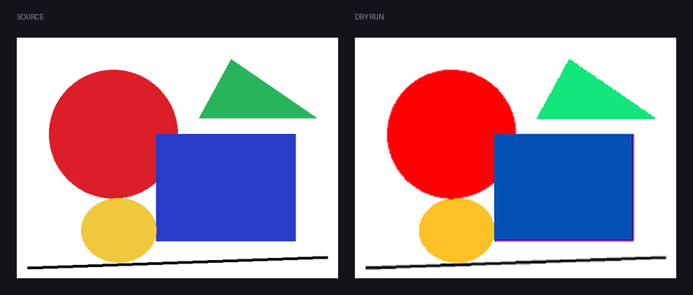

# penplan

[](https://github.com/joyboyisalive07-lab/penplan/actions/workflows/ci.yml)
[](LICENSE)

Воспроизводит изображение на браузерном холсте для рисования, двигая настоящую
мышь, и планирует штрихи так, чтобы рисунок был закончен за заданное вами время.

<br>



Инструмент ничего не знает про конкретный сайт. Он изучает холст по профилю
калибровки: где холст, какие цвета на самом деле в палитре — считанные с экрана,
а не записанные с ваших слов, где кисть и заливка, какие есть размеры кисти.
Gartic Phone, skribbl.io, drawaria.online и Windows Paint для него одна и та же
задача.

Он видит экран и двигает мышь. Он не внедряет скрипты в страницу, не трогает
сетевой трафик сайта, не управляет аккаунтом и вообще не делает сетевых запросов.

English: [README.md](README.md).

## Как работает планировщик

    картинка -> квантование -> области -> заливки -> штрихи -> маршрут -> бюджет -> план
                                                                                    |
                                                        предпросмотр (PNG)   +-> расписание -> исполнение

**Квантование** отображает картинку на палитру профиля в CIE Lab по CIEDE2000, а
не по расстоянию в RGB: равные шаги в RGB не равны шагам восприятия, и разница
видна на коже и на небе. Упорядоченный дизеринг Байера есть и выключен по
умолчанию: он больше чем удваивает число смен цвета вдоль строки, а платит за
каждую бюджет времени.

**Области** — связные участки одного цвета, четырёхсвязные, хранятся
горизонтальными отрезками.

**Заливки** — лучшая сделка в планировщике, один клик вместо тысяч пикселей, и
единственный шаг, способный уничтожить рисунок. Поэтому ни одна не выдаётся на
доверии: контуры рисуются на симулированном холсте, заливка запускается из того
самого семени, по которому будет клик, и один пиксель наружу — отказ. Отказ
ничего не стоит: незакрашенное остаётся незакрашенным, и планировщик штрихов
подберёт его сам.

**Штрихи** получают размер кисти из морфологической эрозии: кисть применяется
только там, где целиком помещается в остаток, поэтому толстая берёт нутро, а
тонкой достаётся граница. Отрезки сцепляются в полилинии и упрощаются алгоритмом
Рамера-Дугласа-Пекера.

**Маршрут** — кластеризованная задача коммивояжёра: перемещение стоит
расстояния, а смена цвета — ещё и похода в палитру. Построение ближайшим
соседом, затем 2-opt по спискам соседей, полный поиск для худших рёбер и Or-opt,
всё под ограничением времени, причём штрих можно рисовать в любую сторону.

**Бюджет** оценивает длительность по модели стоимости, измеренной на вашей
машине, и при перерасходе ухудшает план в объявленном порядке: выбросить мелкие
области, упростить сильнее, отказаться от тонких кистей, урезать палитру.
Ступень остаётся, только если она действительно сократила план, и каждая
сообщает, сколько секунд купила. План, который не влезает, так и говорит.

Подробности в [docs/ALGORITHM.md](docs/ALGORITHM.md), причина каждого
неочевидного решения — в [docs/DECISIONS.md](docs/DECISIONS.md).

## Числа

Всё измерено и воспроизводится тестами и инструментами из этого репозитория.

| | |
| --- | --- |
| CIEDE2000 против 29 опубликованных пар Sharma | совпадает до 1e-4 |
| Планирование рисунка 600x450 из пяти фигур | 0.12 с, 5 заливок, 65 штрихов, 161 точка |
| Этот план против квантованной цели | расходится на 0.24 % пикселей |
| Разбиение на области, 900x700, десять цветов | 59 мс, на худшем шуме 2 с |
| Путь мыши, упорядоченный против исходного | короче на 52-87 % |
| Проходы улучшения против полного 2-opt, 200 штрихов | 16955 за 0.26 с против 16754 за 0.64 с |
| Рисунок на 20.5 с при бюджете 15 с | 9.0 с после четырёх жертв |
| Покрытие планирующих модулей по строкам | 95.1 % |

## Калибровка холста

Сначала расположите окно так, чтобы холст, вся палитра, оба инструмента и все
размеры кисти были видны одновременно. Затем запустите мастер:

```bash
python tools/calibrate.py gartic-phone --measure
```

Наводите курсор на цель и нажимайте **F8**, чтобы снять точку, **F9** — чтобы
закончить список, **Escape** — чтобы прервать. По порядку: левый верхний угол
холста, правый нижний угол холста, каждый цвет палитры, кисть, заливка и каждый
размер кисти от тонкого к толстому.

Во время съёма точек не делается ни одного клика. Клик по углу холста оставил бы
на рисунке точку, а клик по свотчу переключил бы инструмент на середине
калибровки. Цвета палитры читаются после, с курсором, отведённым в центр холста:
свотч под указателем нарисован в состоянии наведения, и эта подсветка попала бы
в профиль вместо цвета.

`--measure` рисует по короткому тестовому штриху на каждый размер кисти и один
зигзаг — этим измеряется, что кисть реально закрашивает и с какой скоростью
холст успевает принимать точки. Это пишет на холсте, так что потом его надо
очистить. Без флага ширины кисти — правдоподобная догадка, и профиль хранит,
что именно у вас из двух.

Профиль ложится в `%APPDATA%\penplan\profiles\` читаемым JSON, который можно
править руками.

Перед отправкой хотя бы одного события мыши палитра считывается с экрана заново
и сверяется с профилем. Если окно переехало или профиль с другой машины,
инструмент называет несовпавший свотч и отказывается работать, а не кликает по
тому, что там теперь оказалось.

## Как пользоваться

Запустите `penplan.exe` или `python -m penplan` из исходников. Выберите профиль,
бросьте картинку в окно, введите доступные секунды и нажмите Draw. До того как
что-либо произойдёт, вы видите оценку длительности, число штрихов, заливок и
цветов, сухой прогон ровно того, что будет нарисовано, и список того, чем бюджет
пожертвовал.

Draw запускает трёхсекундный отсчёт, чтобы вы успели перейти в окно с холстом,
и на время рисования окно убирается с дороги. **Escape останавливает в любой
момент**, отпускает кнопку мыши и возвращает управление.

## Сборка из исходников

```bash
git clone https://github.com/joyboyisalive07-lab/penplan
cd penplan
pip install -e ".[dev]"
pytest
pyinstaller penplan.spec --noconfirm
```

Получается `dist/penplan.exe`, один файл, без установщика, около 18 МБ. Работает
из любого пути, в том числе с пробелами в имени и с флешки.

Python 3.12 или новее, Windows. Единственная runtime-зависимость — Pillow,
остальное стандартная библиотека и ctypes.

## Windows Defender

Исполняемые файлы PyInstaller регулярно отмечаются Defender и другими
антивирусами. Так снаружи выглядит самораспаковывающийся интерпретатор Python,
это случается с любой однофайловой сборкой, а инструмент, который двигает мышь и
читает экран, попадает под шаблон дважды. Сделать с этим с нашей стороны нельзя
ничего, кроме как сказать прямо. Соберите сами командой выше, если не хотите
брать бинарник на веру, или сверьте файл с исходниками, которые здесь можно
прочитать.

## Об использовании в играх

Это автоматизация ввода в играх, которые в общем случае автоматизацию не
разрешают. Оно предназначено для приватных лобби с людьми, которые в курсе, и
для офлайновых холстов. Направить его на незнакомых людей в публичном раунде
значит забрать у них игру, а игра в том и состоит. Это не юридическая позиция, а
просто описание того, что произойдёт.

## Лицензия

MIT, авторские права joyboyisalive07-lab. См. [LICENSE](LICENSE).
